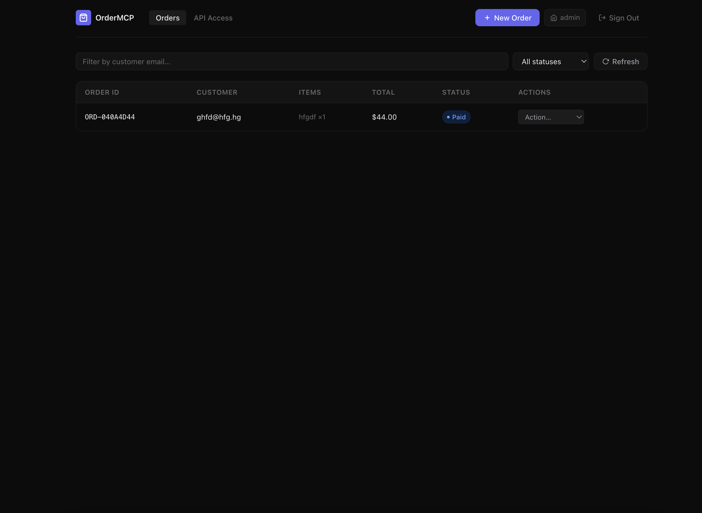
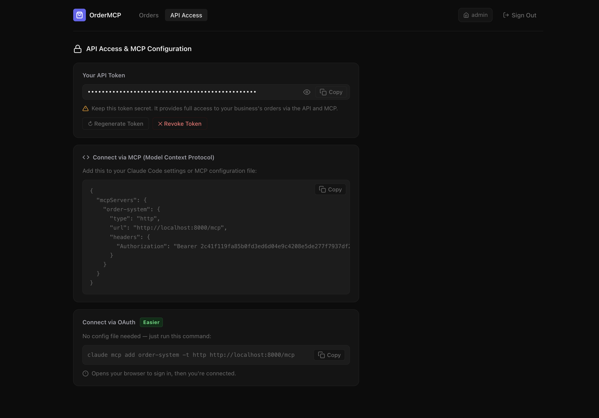
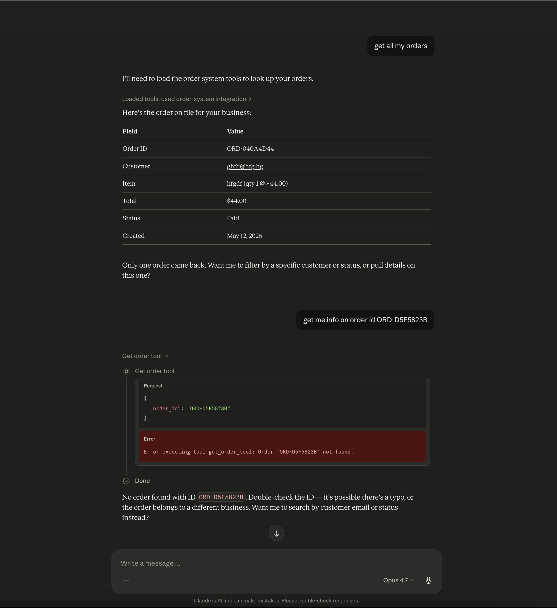
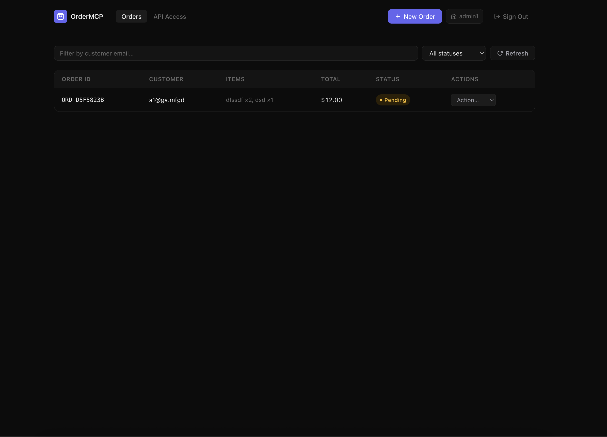

# Order MCP Server

A **multi-tenant order management system** built on the **Model Context Protocol (MCP)**. Each business registers with a name and password, gets its own API token, and can only access its own orders — via REST API, web UI, or any MCP-compatible client (Claude Code, Claude Desktop, etc.).

Backed by **PostgreSQL** for persistence and **Redis** for per-business rate limiting and read caching — both run via Docker Compose.

---

## Proof of Work

Here's the system in action — two businesses, fully isolated, one AI interface.

### The Setup

Two businesses are registered: **admin** and **admin1**. Each has its own orders, its own token, and zero visibility into the other's data. Claude Desktop is connected using **admin's token only**.

---

### Step 1 — admin logs in and sees their orders

The `admin` business has one order: `ORD-040A4D44` — a paid order for customer `ghfd@hfg.hg`.



---

### Step 2 — admin copies their API token and MCP config

The **API Access** tab shows the bearer token and a ready-to-paste MCP configuration block. This is what gets added to Claude Desktop or Claude Code to connect AI directly to this business's order system.



---

### Step 3 — Claude fetches orders via MCP, and proves isolation

Claude Desktop is connected with **admin's token**. When asked to "get all my orders", it calls `search_orders_tool` and returns exactly one result — `ORD-040A4D44`, belonging to admin.

Then it tries to look up `ORD-D5F5823B` — an order that exists in the database, but belongs to **admin1**. The tool returns **not found**. Claude cannot see it. The token boundary is enforced at the database level.

> This is the core proof: even if you know another business's order ID, you cannot access it through a different business's token.



---

### Step 4 — admin1 has their own separate world

Logged in as `admin1`, you see a completely different orders list: `ORD-D5F5823B` — the exact order Claude couldn't find above. Same system, different token, different data.



---

### What this demonstrates

| | admin | admin1 |
|---|---|---|
| Orders visible | ORD-040A4D44 | ORD-D5F5823B |
| Claude can access | ✅ ORD-040A4D44 | ❌ blocked |
| Token | admin's token (set in MCP config) | admin1's token |

Each business gets a private, scoped view of the system — through the web UI, through the REST API, and through AI via MCP. The isolation is not just a UI filter; it is enforced at the query level using `business_id` on every database operation.

---

## MCP Tools

| Tool | Description |
|------|-------------|
| `search_orders_tool` | List your business's orders, optionally filtered by customer email and/or status |
| `get_order_tool` | Fetch a single order by ID (only if it belongs to your business) |
| `create_order_tool` | Create a new order for your business (starts as `pending`) |
| `update_order_status_tool` | Move an order through the status lifecycle |
| `cancel_order_tool` | Cancel a `pending` or `paid` order |
| `refund_order_tool` | Refund a `shipped`, `delivered`, or `paid` order |

---

## Order Data Model

```json
{
  "id":          "ORD-1001",
  "business_id": 1,
  "customer":    "alice@example.com",
  "items": [
    { "sku": "BOOK-42", "qty": 1, "price": 19.99 }
  ],
  "total":      19.99,
  "status":     "shipped",
  "created_at": "2026-05-12T10:00:00+00:00",
  "updated_at": "2026-05-12T10:00:00+00:00"
}
```

**Valid statuses:** `pending` → `paid` → `shipped` → `delivered` → `cancelled` / `refunded`

---

## Database Schema

```
businesses
├── id            SERIAL        PRIMARY KEY
├── name          VARCHAR(255)  UNIQUE NOT NULL
├── password_hash VARCHAR(255)  NOT NULL
└── created_at    TIMESTAMPTZ

api_tokens
├── id          SERIAL       PRIMARY KEY
├── token       VARCHAR(64)  UNIQUE NOT NULL
├── business_id INTEGER      FK → businesses.id  (CASCADE DELETE)
└── created_at  TIMESTAMPTZ

orders
├── id            VARCHAR(50)   PRIMARY KEY
├── business_id   INTEGER       FK → businesses.id
├── customer      VARCHAR(255)  NOT NULL
├── total         NUMERIC(10,2)
├── status        VARCHAR(20)   DEFAULT 'pending'
├── cancel_reason TEXT
├── refund_reason TEXT
├── created_at    TIMESTAMPTZ
└── updated_at    TIMESTAMPTZ

order_items
├── id        SERIAL        PRIMARY KEY
├── order_id  VARCHAR(50)   FK → orders.id  (CASCADE DELETE)
├── sku       VARCHAR(100)
├── qty       INTEGER       CHECK (qty > 0)
└── price     NUMERIC(10,2) CHECK (price >= 0)
```

---

## Project Structure

```
order-mcp/
├── backend/
│   ├── app/
│   │   ├── db/
│   │   │   ├── connection.py      # connection pool + cursor()
│   │   │   └── init.py            # schema bootstrap + migrations
│   │   ├── services/
│   │   │   ├── businesses.py      # register / login (bcrypt)
│   │   │   ├── orders.py          # order business logic (scoped by business_id)
│   │   │   └── tokens.py          # validate / rotate / revoke tokens
│   │   ├── routes/
│   │   │   ├── orders.py          # /api/orders endpoints (auth required)
│   │   │   └── auth.py            # /api/auth/register, /login, /token
│   │   ├── context.py             # ContextVar for current business (HTTP mode)
│   │   ├── dependencies.py        # FastAPI get_current_business Depends
│   │   ├── redis_client.py        # shared Redis client singleton
│   │   ├── ratelimit.py           # sliding-window rate limiter (per business)
│   │   ├── cache.py               # read cache + write invalidation helpers
│   │   ├── mcp.py                 # MCP tool definitions (with caching)
│   │   ├── schemas.py             # Pydantic request/response models
│   │   └── main.py                # FastAPI app + MCPAuthMiddleware at /mcp
│   ├── mcp_server.py              # stdio entry point (reads MCP_BUSINESS_TOKEN)
│   ├── Dockerfile
│   ├── requirements.txt
│   └── init.sql                   # SQL schema for Docker first-run
├── frontend/                      # React + Vite app
├── .mcp.json                      # Claude Code MCP config (project-scoped)
├── docker-compose.yml
└── README.md
```

---

## Requirements

- Python 3.13+
- Docker & Docker Compose
- Dependencies (`backend/requirements.txt`): `mcp`, `psycopg2-binary`, `python-dotenv`, `fastapi`, `uvicorn`, `pydantic[email]`, `bcrypt`, `redis[hiredis]`

---

## Installation

```bash
# 1. Clone the repo
git clone git@github.com:Keyur-Gondaliya/order-mcp.git
cd order-mcp

# 2. Create a virtual environment and install dependencies
python -m venv .venv
source .venv/bin/activate   # Windows: .venv\Scripts\activate
pip install -r backend/requirements.txt

# 3. Configure environment (defaults work with docker-compose)
cp .env.example .env
```

---

## Running with Docker (full stack)

```bash
docker compose up -d
```

| Service | Port | Description |
|---------|------|-------------|
| `db` | 5432 | PostgreSQL 16 |
| `redis` | 6379 | Redis 7 (rate limiting + caching) |
| `backend` | 8000 | FastAPI REST API + MCP HTTP endpoint at `/mcp` |
| `frontend` | 80 | React app served via nginx (proxies `/api` → backend) |

Open **http://localhost** for the web UI, **http://localhost:8000/docs** for API docs.

```bash
docker compose down      # stop (data preserved)
docker compose down -v   # stop + wipe all data
```

---

## Running without Docker

```bash
# Start DB + Redis (required for rate limiting and caching)
docker compose up -d db redis

# In one terminal — REST API + /mcp HTTP endpoint
cd backend
uvicorn app.main:app --reload    # http://localhost:8000

# In another terminal (optional) — MCP stdio server
cd backend
MCP_BUSINESS_TOKEN=<your-token> python mcp_server.py
```

> **Note:** Redis is optional — if `REDIS_URL` is not set or Redis is unreachable, rate limiting and caching are silently skipped and all requests proceed normally.

---

## Authentication

Every business registers once and gets an API token. All API and MCP calls require that token.

### Register a new business

```bash
curl -X POST http://localhost:8000/api/auth/register \
  -H "Content-Type: application/json" \
  -d '{"name": "Acme Corp", "password": "secret123"}'
```

```json
{
  "token": "2c41f119fa85b0fd3ed6d04e9c4208e5de277f7937df2460",
  "business": { "id": 1, "name": "Acme Corp", "created_at": "..." }
}
```

### Log in (get token)

```bash
curl -X POST http://localhost:8000/api/auth/login \
  -H "Content-Type: application/json" \
  -d '{"name": "Acme Corp", "password": "secret123"}'
```

### Verify / refresh token

```bash
curl http://localhost:8000/api/auth/token \
  -H "Authorization: Bearer <your-token>"
```

---

## REST API

All `/api/orders` endpoints require `Authorization: Bearer <your-token>`.

### Orders

| Method | Path | Description |
|--------|------|-------------|
| `GET` | `/api/orders` | List your orders (`?customer=`, `?status=`, `?limit=`) |
| `GET` | `/api/orders/{id}` | Get a single order |
| `POST` | `/api/orders` | Create an order |
| `PATCH` | `/api/orders/{id}/status` | Update status |
| `POST` | `/api/orders/{id}/cancel` | Cancel an order |
| `POST` | `/api/orders/{id}/refund` | Refund an order |

### Auth

| Method | Path | Description |
|--------|------|-------------|
| `POST` | `/api/auth/register` | Register a new business — returns `{token, business}` |
| `POST` | `/api/auth/login` | Log in — returns `{token, business}` |
| `GET` | `/api/auth/token` | Verify token + get business info (auth required) |
| `POST` | `/api/auth/token/regenerate` | Rotate to a new token (auth required) |
| `DELETE` | `/api/auth/token` | Revoke the token (auth required) |

Interactive docs: **http://localhost:8000/docs**

---

## Frontend

Open **http://localhost** (Docker) or `npm run dev` at http://localhost:5173.

The React app shows a login page on first visit. After registering or signing in:

- **Orders tab** — filterable table scoped to your business, with create / update / cancel / refund actions
- **API Access tab** — view/copy your Bearer token, regenerate or revoke it, and get ready-to-paste MCP configuration

To run locally for development:

```bash
cd frontend
npm install
npm run dev    # http://localhost:5173
```

The dev server proxies `/api` to `http://localhost:8000`.

---

## Connecting to Claude Code (CLI)

The project ships a `.mcp.json` at the root — Claude Code auto-loads it when you run `claude` inside the project folder.

### Option A — HTTP (recommended, requires Docker stack running)

Update `.mcp.json` with your token:

```json
{
  "mcpServers": {
    "order-system": {
      "type": "http",
      "url": "http://localhost:8000/mcp",
      "headers": {
        "Authorization": "Bearer <your-token>"
      }
    }
  }
}
```

Get your token from the web UI (API Access tab) or:
```bash
curl -X POST http://localhost:8000/api/auth/login \
  -H "Content-Type: application/json" \
  -d '{"name": "Your Business", "password": "yourpassword"}'
```

### Option B — stdio (no Docker required for the MCP layer)

```json
{
  "mcpServers": {
    "order-system": {
      "command": "/path/to/order-mcp/.venv/bin/python",
      "args": ["/path/to/order-mcp/backend/mcp_server.py"],
      "cwd": "/path/to/order-mcp/backend",
      "env": {
        "MCP_BUSINESS_TOKEN": "<your-token>"
      }
    }
  }
}
```

> **Note:** The database must still be reachable (Docker db service or local PostgreSQL).

### Option C — OAuth via CLI

```bash
claude mcp add order-system -t http http://localhost:8000/mcp
```

---

## Connecting to Claude Desktop

**macOS config file:** `~/Library/Application Support/Claude/claude_desktop_config.json`  
**Windows config file:** `%APPDATA%\Claude\claude_desktop_config.json`

> **Important:** Use `env.PYTHONPATH` (not `cwd`) — Claude Desktop does not support `cwd` in `mcpServers`.

```json
{
  "mcpServers": {
    "order-system": {
      "command": "/path/to/order-mcp/.venv/bin/python",
      "args": ["/path/to/order-mcp/backend/mcp_server.py"],
      "env": {
        "PYTHONPATH": "/path/to/order-mcp/backend",
        "MCP_BUSINESS_TOKEN": "<your-token>"
      }
    }
  }
}
```

Then **fully quit (⌘Q) and reopen** Claude Desktop.

---

## Environment Variables

| Variable | Default | Description |
|----------|---------|-------------|
| `DB_HOST` | `localhost` | PostgreSQL host |
| `DB_PORT` | `5432` | PostgreSQL port |
| `DB_NAME` | `orders` | Database name |
| `DB_USER` | `orders` | Database user |
| `DB_PASSWORD` | `orders` | Database password |
| `REDIS_URL` | _(none)_ | Redis connection URL — rate limiting and caching are disabled if unset |
| `MCP_RATE_LIMIT` | `60` | Max MCP requests per business per window |
| `MCP_RATE_WINDOW` | `60` | Rate limit window in seconds |
| `MCP_CACHE_TTL` | `30` | Read-cache TTL in seconds |

Copy `.env.example` to `.env` and adjust for your environment.

---

## Rate Limiting & Caching

Both features run at the MCP layer and are backed by Redis. They are **non-blocking** — if Redis is unreachable, all requests proceed normally without rate limiting or caching.

### Rate Limiting

Each business is limited to **60 MCP requests per 60-second window** (configurable). The limit is enforced in `MCPAuthMiddleware` immediately after token validation, before any tool runs.

- **Algorithm:** Sliding window using Redis sorted sets. Each request adds a timestamp member; members older than the window are pruned before counting.
- **Response when exceeded:** `HTTP 429` with a `Retry-After: 60` header.
- **Scope:** Per `business_id` — one business hitting the limit does not affect others.

Tune via environment variables:

```bash
MCP_RATE_LIMIT=60   # requests allowed per window
MCP_RATE_WINDOW=60  # window size in seconds
```

### Read Caching

Results from `search_orders_tool` and `get_order_tool` are cached in Redis with a 30-second TTL (configurable via `MCP_CACHE_TTL`).

- **Cache key:** `mcp:cache:{business_id}:{tool}:{md5(params)}`
- **Invalidation:** Any write operation (`create_order_tool`, `update_order_status_tool`, `cancel_order_tool`, `refund_order_tool`) immediately flushes all cached entries for that business.
- **Scope:** Per business — a write by one business never evicts another business's cache.

```bash
MCP_CACHE_TTL=30    # cache TTL in seconds
```

---

## Multi-tenancy

Each business has complete data isolation:

- **Registration** creates a `businesses` row with a bcrypt-hashed password and issues an API token.
- **Every API and MCP request** must include `Authorization: Bearer <token>`. The token is validated and mapped to a `business_id`.
- **Orders are filtered by `business_id`** at the database level — a business can never read or modify another business's orders, even if they know the order ID.
- **MCP HTTP transport** (`/mcp`) is protected by `MCPAuthMiddleware` which validates the token and injects the business context before any tool runs.
- **MCP stdio transport** (`mcp_server.py`) reads `MCP_BUSINESS_TOKEN` at startup and applies the same business scope to all tool calls.

---

## License

MIT
